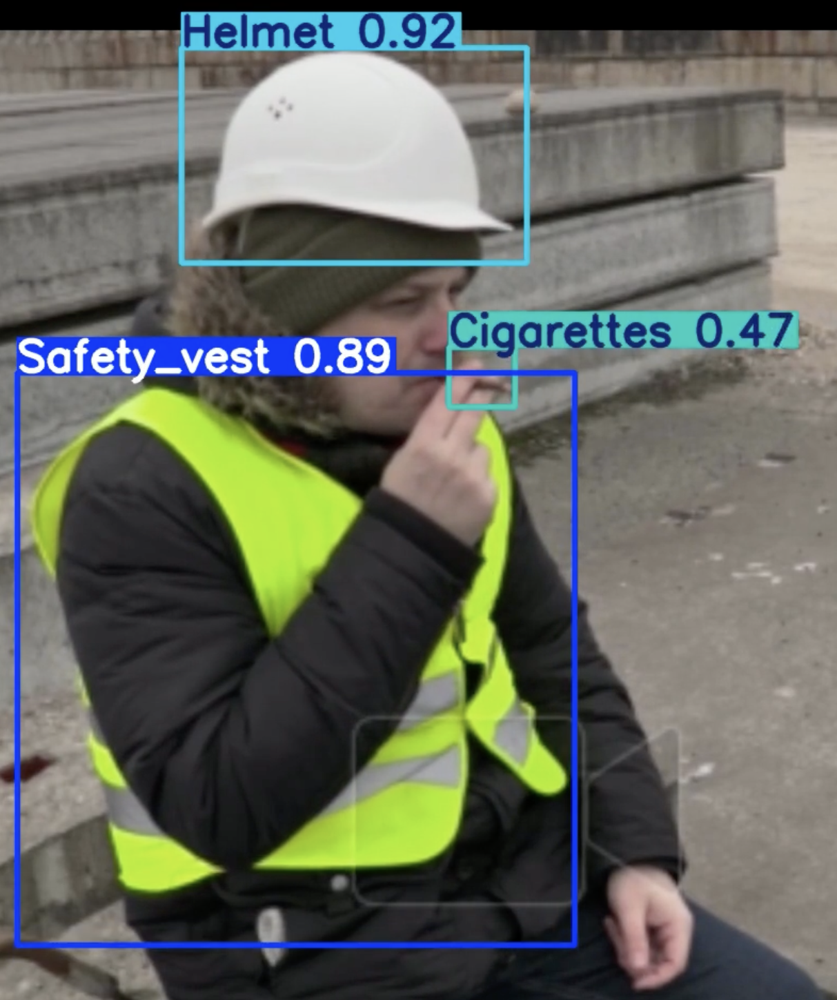
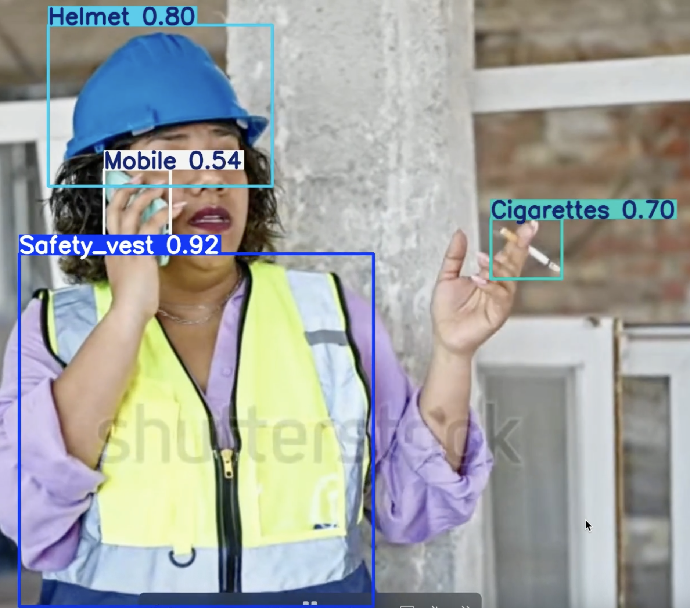
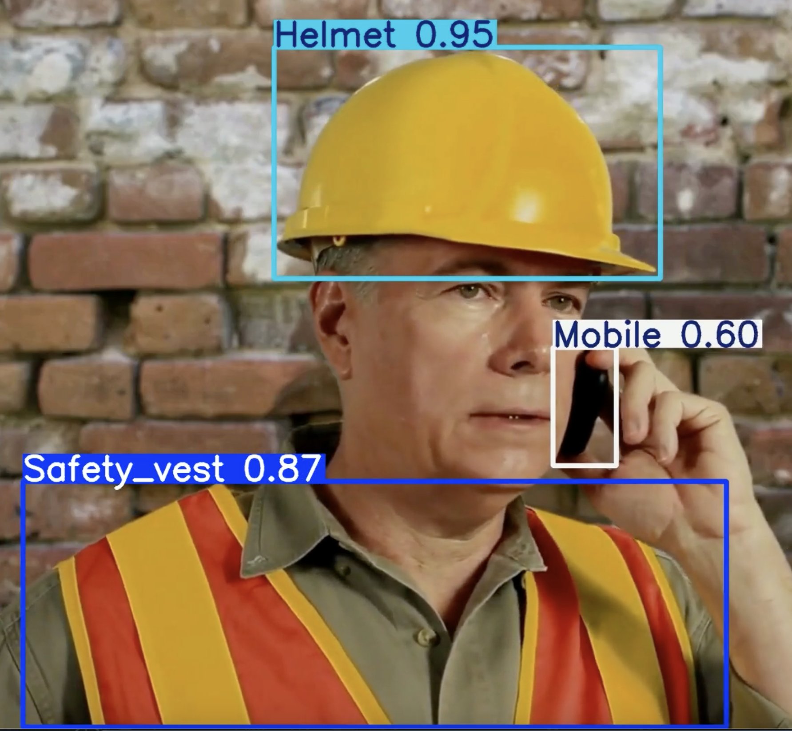

# Unified-Object-Detection-System-for-Industrial-Safety

# 🛡️ Unified Object Detection with YOLOv8: PPE, Mobile Phone, and Smoking Detection

> A deep learning project to build a unified, real-time object detection system using YOLOv8 for detecting personal protective equipment (PPE), mobile phone usage, and smoking behavior in industrial settings.

---

## 📌 Overview

This project aims to improve workplace safety through an **end-to-end unified object detection model** capable of detecting:

- 🦺 **Safety Vests**
- ⛑️ **Helmets**
- 📱 **Mobile Phones**
- 🚬 **Cigarettes (Smoking)**

We compare and fine-tune multiple YOLOv8 variants (`n`, `s`, `m`, `l`, and `x`) to achieve the best trade-off between speed and accuracy.

---

## 🔍 Motivation

Traditionally, separate models are used for each safety-critical task—this increases overhead and system complexity. Our solution:
- Combines all tasks into **one unified model**
- Enables real-time safety monitoring
- Is lightweight enough for edge deployment (with YOLOv8n) and accurate enough for high-performance setups (with YOLOv8s)

---

## 🧠 Model Variants

We experimented with the following YOLOv8 variants:

| Model     | Params (approx) | Inference Speed | Best Use Case        |
|-----------|------------------|------------------|-----------------------|
| YOLOv8n   | ~3.2M            | Fastest (121ms) | Edge, real-time apps  |
| YOLOv8s   | ~11.2M           | Balanced (269ms) | Best accuracy-speed trade-off |
| YOLOv8m/l/x | Higher         | Slower          | Not fine-tuned due to scope |

After augmentation and fine-tuning, **YOLOv8s achieved the best overall performance**.

---

## 📊 Results

### Phase 1: Baseline (no augmentation)

| Model     | Precision | Recall | mAP@0.5 | mAP@0.5:0.95 |
|-----------|-----------|--------|---------|--------------|
| YOLOv8n   | 0.5602    | 0.6949 | 0.6544  | 0.4324       |
| YOLOv8s   | 0.7740    | 0.6781 | 0.7355  | 0.4877       |

### Phase 2: After augmentation & fine-tuning

| Model     | Precision | Recall | mAP@0.5 | mAP@0.5:0.95 |
|-----------|-----------|--------|---------|--------------|
| YOLOv8n   | 0.8572    | 0.8361 | 0.8601  | 0.5278       |
| YOLOv8s   | **0.9153** | **0.8758** | **0.9123** | **0.5908** |

#### YOLOv8s Per-Class mAP (After Tuning)
- Helmet: 0.6790  
- Safety Vest: 0.6165  
- Mobile Phone: 0.6883  
- Cigarette: 0.3794

---

## 🧪 Dataset

- Custom-collected from the web (open-source/educational images)
- Labeled using [MakeSense.ai](https://www.makesense.ai/)
- 4 Classes: Helmet (0), Safety Vest (1), Mobile (2), Cigarette (3)
- Annotation Format: YOLO (normalized bounding boxes)

---

## 🛠️ Methodology

### Phase 1
- Trained all YOLOv8 variants with default hyperparameters
- Input size: 640×640
- Epochs: 100 with early stopping

### Phase 2
- Focused on YOLOv8n and YOLOv8s
- Applied **Albumentations-based augmentation**:
  - Horizontal flip
  - Brightness/contrast
  - Affine transforms
  - Motion blur, coarse dropout
- Fine-tuned with:
  - SGD optimizer
  - Cosine LR scheduler
  - Mosaic, HSV, MixUp enabled

---

## 📈 Evaluation Metrics

- **Precision**: Correct detections / All detections
- **Recall**: Correct detections / All ground truth objects
- **mAP@0.5 / mAP@0.5:0.95**: Mean Average Precision at IoU thresholds
- **Inference Time**: ms/image
- **Fitness Score**: Composite metric from Ultralytics YOLOv8

---

## 🖼️ Sample Outputs

Example detections showing all four object classes in real-world scenarios.

---

## ⚖️ Ethical Considerations

- Only public web images used
- No personal or identifiable data involved
- For safety enhancement only — **not surveillance**

---

## 🚧 Limitations

- Only YOLOv8n and YOLOv8s were fine-tuned
- Dataset may not fully reflect real-world industrial variance
- Cigarette detection remains challenging due to object size and similarity

---

## 🚀 Future Work

- Extend fine-tuning to `m`, `l`, `x` variants
- Real-world deployment in industrial settings
- Model distillation from `s` → `n` for lightweight inference
- Improve cigarette detection with class-specific augmentation
---

## 👥 Contributors

This project was developed as part of the **Deep Learning** course at **Blekinge Institute of Technology (BTH), Sweden**.

- 📂 Original repository by [Sri Kashyap Dongari](https://github.com/srikashyap24/Unified-Object-Detection-System-for-Industrial-Safety)
- 🔁 Forked and extended by [Akhil Rachakonda](https://github.com/akhilrachakonda)

### 🧑‍💻 Akhil Rachakonda's Contributions:
- Integrated advanced data augmentation using the **Albumentations** library
- Trained and fine-tuned **YOLOv8n** and **YOLOv8s** models on a custom-labeled PPE and behavior dataset
- Conducted model evaluation and performance comparison using precision, recall, and mAP metrics
- Built the OpenCV-based real-time inference pipeline for video stream detection
- Analyzed per-class detection metrics and implemented visual result interpretation
- Documented the training methodology and results for the course submission

---

